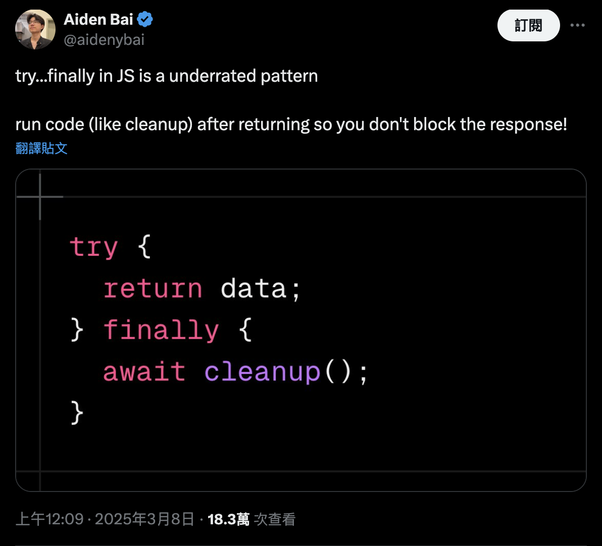
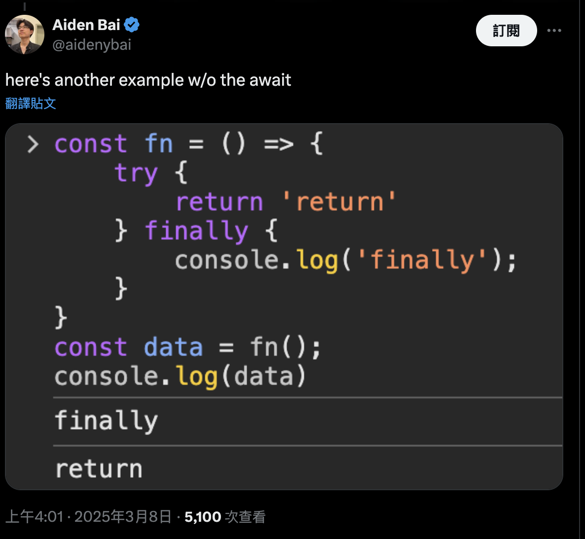

## 來源

* https://x.com/aidenybai/status/1898043212238901444
* https://developer.mozilla.org/en-US/docs/Web/JavaScript/Reference/Statements/try...catch#the_finally_block

原文是希望藉由這樣的寫法，不 block 到 response（`return data`）的情況下，在 `finally` block 做最後的 `cleanup`，但是適得其反，為什麼呢？


他自己也注意到了，`finally` block 會先執行，才回 return `try` block 的值，怎麼會這樣？

## 來看看文件怎麼寫
根據 MDN 的 [The finally block](https://developer.mozilla.org/en-US/docs/Web/JavaScript/Reference/Statements/try...catch#the_finally_block) 段落，寫道 `finally` block 執行的時機點有 3 個：
> * Immediately after the `try` block finishes execution normally (and no exceptions were thrown);
> * Immediately after the `catch` block finishes execution normally;
> * Immediately before the execution of a control-flow statement (`return`, `throw`, `break`, `continue`) in the `try` block or `catch` block that would exit the block.

前面兩點相信很好懂，重點在第三點：「`finally` 會在執行任何 control-flow statement 之前就會馬上執行，包括在 `try` block 和 `catch` block 當中，可能會導致離開 block 的 control-flow statement」

### What is control-flow statement?
根據上面原文來舉例，就會是 `try` block 裡面的 `return` ，因此 `finally` block 的 `await cleanup()` 會先執行，才執行 `try` block 的 return

舉個例子：
```js
const fn = () => {
  try {
    console.log("try");
    return "true";
  } finally {
    console.log("finally");
  }
};

const data = fn();
console.log("data: ", data);
```


print log 的順序會是：
```
try
finally
true
```

可以看到 `try` block 的return 最後才被執行

如果把上面例子的 `return “true”` 改成 `throw “123”`：
```js
const fn = () => {
  try {
    console.log("try");
    throw "123";
  } finally {
    console.log("finally");
  }
};

const data = fn();
console.log("data: ", data);
```

print log 的順序會是：
```
try
finally
Error: 123
```

結果差不多，可以看到 throw 錯誤之前，`finally` block 會先被執行

回到原文中的例子：
```js
const cleanup = () =>
  new Promise((resolve) => {
    console.log("resolve");
    resolve();
  });

const fn = async () => {
  try {
    console.log("try");
    return "true";
  } finally {
    console.log("finally");
    await cleanup();
  }
};

fn().then((data) => {
  console.log("data: ", data);
});
```
print 出 log 的順序則是：
```
try
finally
resolve
data:  true
```
很明顯可以看到 `finally` block 的 promise 執行完之後，才執行 `return “true”`


## 可以用什麼替代原文作者的寫法？

### 只在 `finally` block 寫 control-flow statement（not perfect）
```
const fn = async () => {
  try {
    console.log("try");
  } finally {
    cleanup();
    return "true"
  }
};
```
有網友提供這樣的寫法，可以在 `cleanup` 後接著 return value，一石二鳥。不過如果今天 `try` block 裡面需要 await data 或做其它事，必須還得在外面 assign 一個變數，才能讓 `finally` block return data 出去，像這樣：
```js
const fn = async () => {
  let data;
  try {
    console.log("try");
    data = await doSomething();
  } finally {
    cleanup();
    return data;
  }
};
```
另外就是，假如希望 `catch` block 能 throw error 或 return error 到外面去，讓外部知道有 error，這種寫法可能就不適合了。

### 老老實實地在 `try…catch` 執行完的下一行做 cleanup
```js
const cleanup = () =>
  new Promise((resolve) => {
    console.log("resolve");
    resolve();
  });

const fn = () => {
  try {
    console.log("try");
    return "true";
  } catch (error) {
    console.log("error: ", error);
  }
};

fn();
cleaup();
```
夠粗暴，且簡單與直覺。

### 用 `.finally()`
```js
const cleanup = () =>
  new Promise((resolve) => {
    console.log("resolve");
    resolve();
  });

const fn = async () => {
  try {
    console.log("try");
    return "true";
  } catch (error) {
    console.log("error: ", error);
  }
};

fn()
  .then((data) => {
    console.log("data: ", data);
  })
  .finally(() => {
    console.log("finally");
    cleanup();
  });
```
可以用 `.finally()` 的方式來做取代，這種方式基本上可以確保 return 值之後，才會進到 `.finally()`，缺點就是寫起來會變得又臭又長?

要寫得比較完整的話，可以再加上 `.catch()`
```js
const cleanup = () =>
  new Promise((resolve) => {
    console.log("resolve");
    resolve();
  });

const fn = async () => {
  try {
    console.log("try");
    return "true";
  } catch (error) {
    throw error;
  }
};

fn()
  .then((data) => {
    console.log("data: ", data);
  })
  .catch((error) => {
    console.log("error: ", error);
  })
  .finally(() => {
    console.log("finally");
    cleanup();
  });
```

### 另一個比較常見的寫法：用 `Promise` 包著
```js
const cleanup = () =>
  new Promise((resolve) => {
    console.log("resolve");
    resolve();
  });

const fn = () => {
  return new Promise((resolve, reject) => {
    try {
      console.log("try");
      resolve("true");
    } catch (error) {
      reject(error);
    }
  });
};

fn()
  .then((data) => {
    console.log("data: ", data);
  })
  .catch((error) => {
    console.log("error: ", error);
  })
  .finally(() => {
    console.log("finally");
    cleanup();
  });
```

## 千萬別這麼做
看到原文串有人舉一個例子表示千萬別這麼做，否則會討厭你自己
```js
function tryMe() {
  console.log("1. start!");
  try {
    return "2. return from try";
  } catch (error) {
    return "3. return from catch";
  } finally {
    return "4. return from finally";
  }
}

console.log(tryMe());
```
log 的順序將會是：
```
1. start!
2. return from finally
```
沒錯，直接略過 `try` 跟 `catch` block

即使你今天在 `try` block 丟出一個錯誤，也不會 return `catch` block 的字串

## 總結

`finally` block 目前看起來存在著些違反直覺的機制，可能會在無意中寫出令你驚喜的情況，看起來能不用就不用，似乎也沒有非得使用的必要。若仍要使用，請絕對要小心服用，並有意識地在知道 `finally` block 的機制下去做使用。

### 網友分享另一個變形題
```js
const xit = async () => {
  const zit = () => {
    console.log("second");
    return "fourth";
  };

  try {
    await new Promise((resolve) => setTimeout(resolve), 100);
    console.log("first");
    return zit();
  } finally {
    console.log("third");
  }
};

(async () => {
  const data = await xit();
  console.log("data: ", data);
})();
```
猜猜答案會是什麼？


<details>
  <summary>Answer</summary>

```
first
second
third
data:  fourth
```

([ref](https://x.com/berliangor/status/1898252789639520282))

</details>